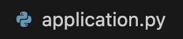
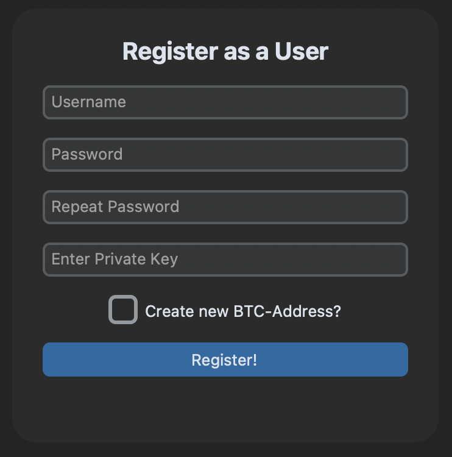
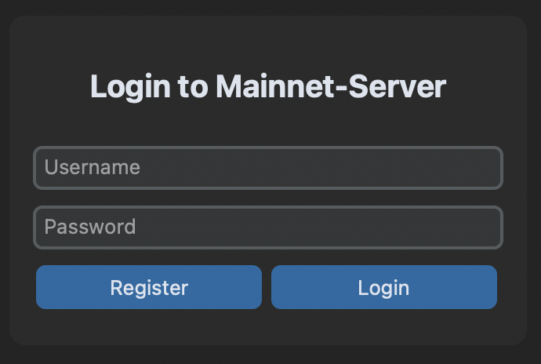
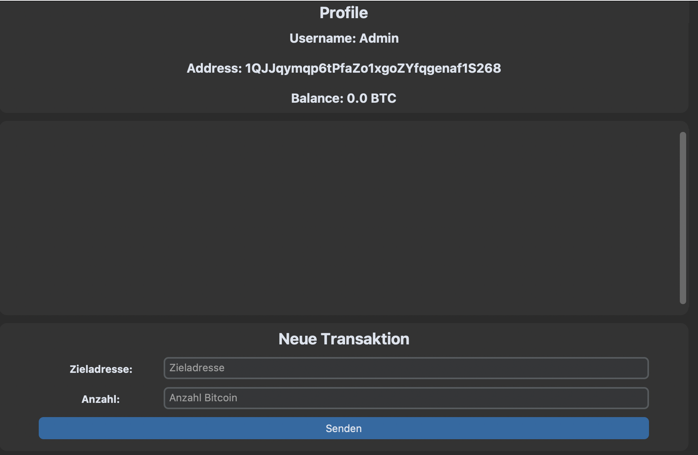
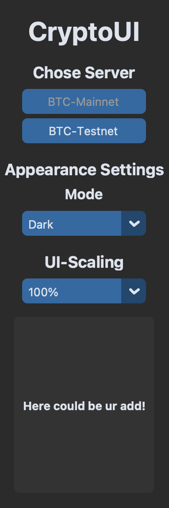

# CryptoUI
<a name="readme-top"></a>
***
## Inhaltsverzeichnis
<!-- Inhaltsverzeichnis -->
<ol>
    <li>
        <a href="#Allgemeine-Informationen">Über das Project</a>
        <ul><li><a href="#Technologien">Technologien</a></li></ul>
    </li>
    <li>
        <a href="#getting-started">Getting Started</a>
        <ul>
            <li><a href="#voraussetzungen">Voraussetzungen</a></li>
            <li>
                <a href="#installation">Installation</a>
                <ul>
                    <li><a href="#konsole">Mit Konsole</a></li>
                    <li><a href="#ohneKonsole">Ohne Konsole</a></li>
                </ul>
            </li>
            <li>
                <a href="#anleitung">Anleitung</a>
                <ul>
                    <li><a href="start">Starten der Anwendung</a></li>
                    <li><a href="register">Anlegen eines Accounts</a></li>
                    <li><a href="login">Login</a></li>
                    <li><a href="profile">Profil</a></li>
                    <li><a href="utilities">Einstellungen</a></li>
                </ul>
            </li>
        </ul>
    </li>
    <li><a href="#mitwirkende">Mitwirkende des Projektes</a></li>
</ol>

***
<!-- ABOUT THE PROJECT -->
## Über das Projekt
<a name="Allgemeine-Informationen"></a>

Dieses Projekt wurde im Auftrag von Lukas Osterheider - Kursleiter des IT-Security Kurses der Hochschule Bochum - erstellt. Es handelt sich hierbei, um eine Software, welche dafür gedacht ist Bitcoin-Transaktionen mittels Userinterface zu erstellen.


<!-- Technologien -->
### Technologien
<a name="Technologien"></a>

Eine Liste der verwendeten Technologien und ein paar Bibliotheken:
* [Python](https://www.python.org): Version 3.11.3
* [CustomTkinter](https://customtkinter.tomschimansky.com): Version 5.1.2
* [Sqlite3](https://docs.python.org/3/library/sqlite3.html): Version 3.39.4


<p align="right">(<a href="#readme-top">back to top</a>)</p>

***
<!-- Getting Started -->
## Getting Started
<a name="getting-started"></a>
Hier erfährst du, wie du CryptoUI bei dir Zuhause aufsetzen und nutzen kannst.

### Voraussetzungen
<a name="Voraussetzungen"></a>
Um CryptoUI zum laufen zubringen, müssen eventuell folgende Befehle manuell ausgeführt werden:

* customtkinter
```sh
  pip3 install customtkinter
```
* pycryptodome
```sh
  pip3 install pycryptodome
```
* ecdsa
```sh
  pip3 install ecdsa
```
* base58
```sh
  pip3 install base58
```
* blockcypher
```sh
  pip3 install blockcypher
```

<p align="right">(<a href="#readme-top">back to top</a>)</p>

## Installation
<a name="installation"></a>

_Unten findest du zwei Beispiele wie du CryptoUI bei dir installieren kannst!_

### Mit Konsole
<a name="konsole"></a>

1. Lass dir in den Einstellungen einen kostenlosen Zugangsschlüssel über Github erstellen.
2. Klone das Repository mit:
   ```sh
   git clone https://github.com/SimonBrinker/IT-Sicherheit-bitcoin-wallet.git
   ```
3. Gebe wenn aufgefordert deinen Github-Nutzernamen ein.
   
4. Gebe wenn aufgefordert dein Zugangsschlüssel ein, denn du bei Schritt 1 generieren lassen hast.

5. Öffne nun das geklonte Repository über die IDE deiner Wahl.

6. Falls nötig installiere über die Konsole die oben genannten Module.

### Ohne Konsole
<a name="ohneKonsole"></a>

1. Klicke auf folgenden Link, um das Projekt als ZIP-Datei zu downloaden: 
   https://github.com/SimonBrinker/IT-Sicherheit-bitcoin-wallet/archive/refs/heads/main.zip

2. Entpacke die Zip-Datei in einem Ordner.

3. Öffne den Ordner über die IDE deiner Wahl.

4. Falls nötig installiere über die Konsole die oben genannten Module.

<p align="right">(<a href="#readme-top">back to top</a>)</p>

***
<!-- Anleitung -->
## Anleitung
<a name="anleitung"></a>

### Starten der Anwendung
<a name="start"></a>

Zum starten von CryptoUI muss man die 'application.py'-Datei ausführen.

<div align="center">
    
</div>

### Anlegen eines Accounts
<a name="register"></a>

Um einen Account anzulegen muss man folgende Eingabefelder mit Werten belgen:
* Username: Der Username darf mindestens 5 maximal 15 Zeichen enthalten.
* Password: Das Passwort muss länger als 8 Zeichen sein. Mindestens eine Zahl oder ein Sonderzeichen
  und mindestens ein Groß- und Kleinbuchstaben enthalten.
* Falls kein "privatkey" vorhanden ist, muss das Häckchen bei "Create new Btc-Address?" gesetzt 
  werden.

Nachdem man alle Eingabefelder mit Werten belegt hat, muss man auf den "Register!-Butoon" klicken.
Danach sollte man normalerweise direkt eingeloggt werden.

<div align="center">
    
</div>

### Anmelden
<a name="login"></a>

Um sich anzumelden muss man im Startfenster seine Benutzerdaten eingeben. Benutzt man die Anwendung
zum ersten Mal, muss man zuvor einen Benutzer anlegen. CryptoUI speichert die Benutzerdaten der User
lokal auf dem Gerät und greift mithilfe einer Api auf Informationen wie zum Beispiel den Kontostand zu.

<div align="center">
    
</div>

### Der richtige Umgang im Profil
<a name="profile"></a>

Im oberen Part des Profils werden die Benutzerinformationen angezeigt. Man kann dort den Benutzernamen des aktuellen Kontos, die Bitcoin-Adresse und seinen Kontostand in Btc oder tBtc
betrachten.

In der Mitte des Fensters ist ein verschiebares Fenster, in welchem alle getätigten Transaktionen angezeigt werden. 

Im unteren Part kann man eine Transaktion erstellen, in dem man die Felder für "Zieladresse" und "Anzahl Bitcoin" mit den entsprechenden Werten belegt. Zum senden der Transaktion muss man seine Eingabe nun nurnoch mit einem Klick auf den "Send-Button" bestätigen. 

<div align="center">
    
</div>

### Einstellungen
<a name="utilities"></a>

Mit den Einstellungen lassen sich global einige Parameter anpassen:
* Mithilfe der zwei Buttons zur Auswahl des Servers kann man zwischen BTC-Mainnet und BTC-Testnet 
  server wechseln.
* Mithilfe der Dropdown-Menües lässt sich das Interface äußerlich anpassen. Es ist dadurch möglich
  zwischen Light- und Darkmode zu wechseln und die Skalierung des Interfaces zu ändern.

<div align="center">
    
</div>

***
<!-- Mitwirkende Personen am Projekt -->
## Mitwirkende des Projektes
<a name="mitwirkende"></a>

Alle Mitglieder die am Projekt mitgewirkt haben, haben sich im gleichenmaße beteildigt.

* Cedric Kranz
* Cengizhan Ömür
* Emre Akarsu
* Keanu Pastuschka
* Simon Brinker

***


